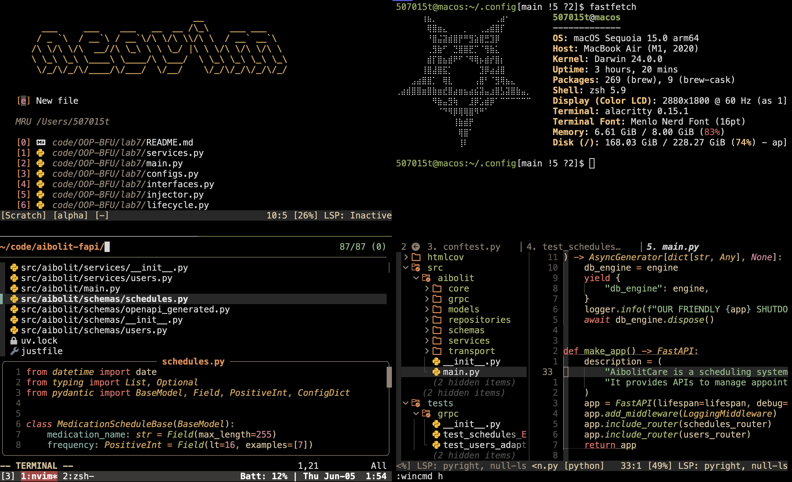

# 507015t(soloist) dotfiles🎃
## Contents
- Vim (Neovim) config
- [Kitty](https://sw.kovidgoyal.net/kitty/)(terminal) config
	Font **JetBrains Mono NL**
- [Tmux](https://github.com/tmux/tmux) config
- Zsh config
- Corne choc (42 keys) config
- [lf](https://github.com/gokcehan/lf) config
- [Yabai](https://github.com/koekeishiya/yabai) & [SKHD](https://github.com/koekeishiya/skhd) config
- [Fastfetch](https://github.com/fastfetch-cli/fastfetch) config 
## Clean Setup (MacOS)
git clone git@github.com:507015T/dopefiles.git ~/.config/ && ~/.config/install.sh

- Install **Brew**
```Shell
/bin/bash -c "$(curl -fsSL https://raw.githubusercontent.com/Homebrew/install/HEAD/install.sh)"
```
- Install [OhMyZsh](https://ohmyz.sh/)
```Shell
sh -c "$(curl -fsSL https://raw.githubusercontent.com/ohmyzsh/ohmyzsh/master/tools/install.sh)"
```
- Install **KITTY, NEOVIM, TMUX, LF, YABAI, SKHD, FASTFETCH**
```Shell
brew install kitty
brew install neovim
brew install tmux
brew install lf
brew install yabai 
brew install skhd
brew install fastfetch
```
- Remove old nvim config
```Shell
rm -rf ~/.config/nvim
rm -rf ~/.local/state/nvim
rm -rf ~/.local/share/nvim
```
- Remove old tmux, lf, yabai, skhd, fastfetch, kitty configs
```Shell
rm ~/.tmux.conf && rm -rf ~/.tmux 
rm -rf ~/.config/lf
rm -rf ~/.config/yabai
rm -rf ~/.config/skhd
rm -rf ~/.config/fastfetch
rm -rf ~/.config/kitty
```
- Clone Repo and finally setup
```Shell
git clone git@github.com:507015T/dopefiles.git
mv dopefiles/.config/nvim ~/.config/
mv dopefiles/.config/kitty ~/.config/
mv dopefiles/.tmux.conf ~/
mv dopefiles/.config/lf ~/.config/
mv dopefiles/.config/yabai ~/.config/
mv dopefiles/.config/skhd ~/.config/
mv dopefiles/.config/fastfetch ~/.config/
mv dopefiles/.config/kitty ~/.config/
rm -rf ~/.zshrc && mv dopefiles/.zshrc ~/
```

### All commands at once
```Shell
/bin/bash -c "$(curl -fsSL https://raw.githubusercontent.com/Homebrew/install/HEAD/install.sh)"
sh -c "$(curl -fsSL https://raw.githubusercontent.com/ohmyzsh/ohmyzsh/master/tools/install.sh)"
brew install kitty
brew install neovim
brew install tmux
brew install lf
brew install yabai 
brew install skhd
brew install fastfetch
rm -rf ~/.config/nvim
rm -rf ~/.local/state/nvim
rm -rf ~/.local/share/nvim
rm ~/.tmux.conf && rm -rf ~/.tmux 
rm -rf ~/.config/lf
rm -rf ~/.config/yabai
rm -rf ~/.config/skhd
rm -rf ~/.config/fastfetch
rm -rf ~/.config/kitty
git clone git@github.com:507015T/dopefiles.git
mv dopefiles/.config/nvim ~/.config/
mv dopefiles/.config/kitty ~/.config/
mv dopefiles/.tmux.conf ~/
mv dopefiles/.config/lf ~/.config/
mv dopefiles/.config/yabai ~/.config/
mv dopefiles/.config/skhd ~/.config/
mv dopefiles/.config/fastfetch ~/.config/
mv dopefiles/.config/kitty ~/.config/
rm -rf ~/.zshrc && mv dopefiles/.zshrc ~/
```
